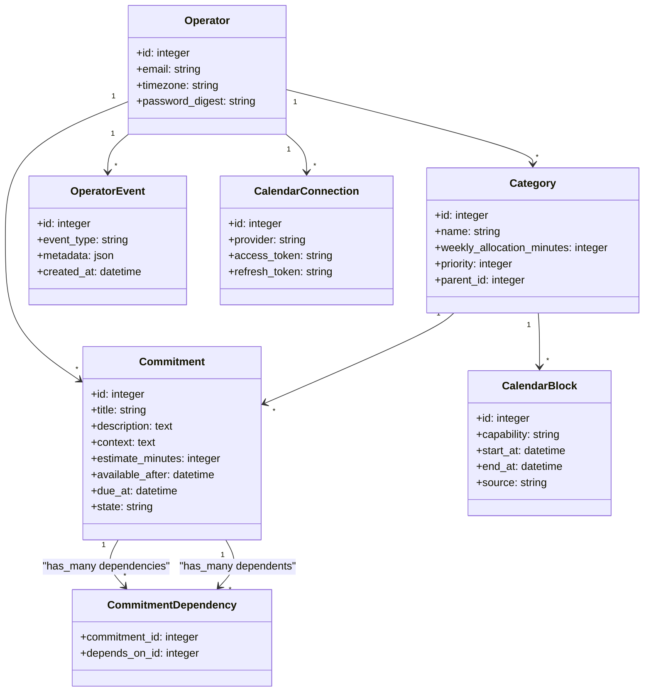

# Kern System Design v0.7

## Goal

Transform commitments into clear attention.

The operator defines values through categories and allocates time to those categories.

Kern continuously schedules commitments according to those constraints.

The goal is not productivity.

The goal is reducing unnecessary decisions.

---

# Core Principles

1. Attention is finite.
2. Attention has type.
3. The operator owns values.
4. Reality overrides schedules.
5. Recommendations are explainable.
6. Complexity must justify itself.
7. The operator remains sovereign.
8. Persistent things represent reality. Temporary things represent decisions.

---

# System Scope

Kern is:

* Attention allocation
* Recommendation generation
* Calendar synchronization

Kern is not:

* Goal setting
* Habit tracking
* Project management
* Time tracking
* Productivity optimization
* AI or ML prediction

The system is deterministic.

Inspectability is the value proposition, not prediction.

---

# Core Model

```text
Categories (Values + Allocations)
    +
Capability
    +
Commitments
    +
Calendar Blocks
    ↓
Kernel
    ↓
Recommendation
```

Attention is not just quantity. It is type.

The scheduling equation is:

```text
Values + Allocations + Capability + Commitments + Reality
    ↓
Kernel
    ↓
Recommendation
```

---

# Bounded Contexts

## 1. Operator Context

Manages identity and preferences.

Owns:

* account
* timezone
* review preferences

---

## 2. Category Context

Represents values through attention allocation.

Owns:

* categories
* priorities
* allocations
* attention debt
* category hierarchy

---

## 3. Commitment Context

Stores all attention competitors.

Owns:

* commitments
* states
* estimates
* constraints (due_at, available_after)
* categorization
* capabilities
* dependencies
* operator events

---

## 4. Calendar Context

Maintains calendar synchronization.

Owns:

* calendar connections
* category blocks
* block capabilities
* sync state

Does not own commitments.

---

## 5. Kernel Context

Decision engine (Pure Function).

Owns:

* recommendation generation
* capability matching
* ranking
* allocation balancing
* attention debt calculation
* explanation generation

Recommendations remain ephemeral views.

---

# Domain Model

## Operator

The human using Kern.

An operator owns:

* id
* email
* timezone
* review_settings

---

## Capability

A capability represents a type of attention.

Attention is not uniform. A 90-minute block of deep focus is not interchangeable with 90 minutes of social energy.

Examples:

* deep — sustained focus, complex reasoning
* light — simple tasks, low cognitive load
* social — calls, meetings, conversations
* admin — email, paperwork, logistics
* physical — exercise, errands, movement
* creative — writing, design, open-ended thinking

A capability is a label, not a hierarchy.

The operator defines which capabilities exist.

---

## Category

A category represents an area of life.

Examples:

* Health
* Work
* Relationships
* Learning
* Maintenance
* Exploration

A category owns:

* id
* name
* description
* priority
* weekly_allocation_minutes
* parent_id (optional)

Values are expressed through category priorities and time allocations.

There is no separate Value entity.

Category allocations define when and how much attention an area of life receives.

There is no separate working hours entity.

---

## Attention Debt

Attention debt is the difference between what was intended and what actually happened.

```text
Health
  allocated:  7h
  actual:     2h
  debt:       5h
```

Allocation is intention.

Actual is reality.

The difference drives rebalancing.

A category tracks:

* allocated_minutes — what the operator intended this week
* actual_minutes — what was actually spent
* attention_debt — the difference

Attention debt is computed, not stored permanently.

It is recalculated every scheduling run from operator events.

Attention debt feeds directly into scoring. Categories with higher debt receive stronger weight.

This is the heart of weekly balancing.

---

## Commitment

A commitment is anything competing for attention.

Examples:

* Finish proposal
* Call mother
* Exercise
* Buy groceries

A commitment owns:

* id
* title
* description
* context
* category_id
* capability
* estimate_minutes
* due_at (optional timestamp)
* available_after (optional timestamp)
* state

Context holds anything the operator wants to remember about the commitment.

Capability declares what type of attention this commitment requires.

A commitment without a capability is assumed to match any block.

---

# The Tripartite Model

Kern separates the commitment lifecycle into three completely independent, orthogonal concerns. The Kernel is a pure function that reads the truth, reads the history, and generates the view.

## 1. Commitment State (Persistent Truth)

A state answers only one question: What is currently true about this commitment in reality?

States are durable and mutually exclusive:

* **inbox** — Captured. Needs processing.
* **ready** — Executable. No blockers. Eligible for scheduling.
* **blocked** — Cannot execute. Waiting on dependencies.
* **done** — Completed.
* **archived** — Removed from active life permanently.

Notice what is missing: There is no `deferred`, `scheduled`, `current`, or `next` state. Those are not durable truths; they are ephemeral views or time constraints. 

## 2. Recommendation State (Ephemeral View)

Every scheduling run produces temporary outputs. These are destroyed and regenerated continuously. The scheduler never mutates the commitment's persistent state.

Views:

* **Primary** — Do now.
* **Secondary** — Do if time remains.
* **Hidden** — Ready, but didn't fit, or intentionally postponed via time constraint.
* **Expired** — Block has passed.

A commitment does not "become" scheduled. It is simply selected by the Kernel to fill a temporary view.

## 3. Operator Events (History)

User decisions modify the world, not arbitrarily change state. The operator generates events, and the system reacts.

Events:

* **Capture** — Creates a new commitment in `inbox`.
* **Complete** — Transitions state to `done`.
* **Defer** — Sets the `available_after` timestamp. The commitment remains in `ready` state, but the scheduler receives the instruction: "Do not recommend until X." Time passes automatically; no manual un-deferral is required.
* **Archive** — Transitions state to `archived`.

Persistent things represent reality. Temporary things represent decisions. Operator actions are history. Keeping these separate makes the system robust and explainable.

---

## Commitment Relationships (DAG)

The DAG models structural relationships between commitments. It answers: What can be done?

A commitment may depend on another commitment.

```text
File taxes
  depends on → Collect documents
```

A dependency owns:

* commitment_id (the one waiting)
* depends_on_id (the one that must complete first)

Dependencies must be acyclic. The system validates this on creation.

The DAG belongs purely to the constraint phase of scheduling. It eliminates impossible recommendations. 

When a commitment transitions to `done`, the system checks immediate dependents. If a dependent's dependencies are all `done`, it transitions from `blocked` to `ready`.

There is no project entity. Projects emerge naturally from:

* Category
* Dependency graph 

Adding a separate project concept would create a second hierarchy. Avoid.

---

## Calendar Block

A calendar block represents reserved attention.

Calendar blocks belong to categories, not commitments.

A calendar block owns:

* id
* category_id
* capability
* start_at
* end_at
* source

Capability declares what type of attention this block offers.

```text
Work Block
  capability = deep

Evening Block
  capability = light
```

Source:

* kern — generated from category allocation
* operator — created manually

---

## Recommendation

A recommendation is a scheduling result generated by the Kernel.

A recommendation owns:

* commitment_id
* reasons[]
* generated_at

### Explainability Contract

A recommendation explanation must contain exactly three parts:

1. Category reason — why this category deserves attention now
2. Time reason — why this block is suitable
3. Commitment reason — why this specific commitment

Every reason is a plain-language statement. No scores. No numbers the operator cannot trace.

Example:

```text
Write proposal

Reasons:
- Work allocation is 5 hours under target this week
- 90-minute deep block is available now
- Due in 2 days
```

The contract is enforceable. If a recommendation cannot produce all three reasons, it must not be generated.

Recommendations are ephemeral.

They are generated, not stored permanently.

---

# Time Model

Kern is the source of truth for attention allocation.

Google Calendar is the external representation of that allocation.

Kern owns a dedicated calendar.

Kern creates and updates category time blocks through the Google Calendar API.

Calendar blocks belong to categories, not commitments.

Commitments are scheduled into category time.

Commitments are not written directly to the calendar.

The operator edits category allocations inside Kern.

Kern reflects those allocations into Google Calendar.

Kern never modifies external calendars.

External calendars only affect availability calculations.

### Source of Truth

```text
Categories
    → Kern

Allocations
    → Kern

Time Blocks
    → Kern

Calendar Events
    → Google Calendar mirror
```

### Example

```text
Work
  20 hrs/work-week
  10 AM to 2 PM
  capability = deep

Health
  7 hrs/week
  9 PM to 10 PM
  capability = physical
```

Kern translates allocations into calendar blocks.

---

# Decision Flow

The decision cycle is continuous.

```text
Operator
    ↓
Values + Allocations + Capabilities + Commitments (State + History)
    ↓
Kernel
    ↓
Recommendations (Views)
    ↓
Action (Events)
    ↓
Reality
    ↓
Kernel (cycle continues)
```

Reality feeds back into every scheduling run.

---

# Reality Feedback

Reality will diverge from the schedule. The system must adapt, not resist.

The operator signals reality in two ways:

1. **Synchronously**: When the operator acts on a recommendation (e.g., marking a commitment as `done` or `deferred`).
2. **Asynchronously**: During Daily or Weekly reviews, where the operator can reconcile what actually happened against the schedule.

When reality diverges:

1. The Kernel re-runs with updated availability.
2. Remaining allocation rebalances within the current week.
3. Attention debt updates automatically based on event history.
4. No penalty. No guilt. The system adapts.

No inference of skips:

The system never infers user action or automatically skips commitments. If a scheduled block passes without explicit operator action, the commitment remains in its current state (e.g., `ready`) and remains eligible for future recommendations. 

To clear or postpone a commitment, the operator must manually log a **Defer** or **Archive** event.

The system only asks what deserves attention now.

---

# Scheduling Flow

```text
Values + Capabilities
    +
Calendar Blocks (with capabilities)
    +
Commitments (with capabilities + dependencies + time constraints)
    ↓
Kernel
    ↓
Recommendations
    ↓
Action (generates events)
    ↓
Reality (attention debt updates)
    ↓
Kernel
```

---

# Scheduling Pipeline

## Inputs

* ready commitments (filtered by time constraints)
* category allocations (with attention debt)
* calendar blocks (with capabilities)
* deadlines
* current time

## 1. Collect

Load:

* categories
* calendar blocks
* commitments
* dependency graph
* attention debt

## 2. Filter

Remove:

* done commitments
* archived commitments
* blocked commitments (waiting on DAG dependencies)
* commitments where `current_time < available_after` (deferred via time constraint)
* inbox commitments
* commitments that do not fit available time
* commitments whose capability does not match the current block

Capability match is the first structural filter. It runs before scoring.

A commitment requiring deep focus will never be recommended during a light block.

## 3. Score

Apply:

* attention debt (category allocation deficit)
* urgency (due date proximity)
* available block size
* commitment size

Attention debt is the primary scoring signal.

Categories that have been neglected relative to their allocation receive stronger weight.

## 4. Rank

Produce ordered candidates.

## 5. Explain

Every recommendation must satisfy the explainability contract.

Three reasons required:

```text
Why this category?
Why this time?
Why this commitment?
```

If the contract cannot be satisfied, the recommendation is not generated.

## 6. Act

Operator accepts, ignores, delays, or completes work.

All outcomes are valid.

The operator remains sovereign.

---

# Reviews

Reviews are recommended, not required.

The system remains fully functional without them.

Skipping a review is a valid operator choice.

The operator may batch reviews on the weekend.

## Daily

Purpose:

* triage inbox
* adjust commitments
* review recommendations
* re-balance categories if necessary

## Weekly

Purpose:

* review categories
* review allocations
* review attention debt
* rebalance attention

---

# UX

## Primary Screen

Shows:

* current recommendation
* current category
* current calendar block
* current capability
* reasons (all three)
* next recommendation

The answer should be obvious.

---

## Capture

Fastest possible commitment capture.

Low friction.

No categorization required at capture time.

No capability required at capture time.

Captured commitments go to the inbox.

---

## Calendar

Google Calendar remains the visual representation of time.

Kern remains the scheduling engine.

---

# Implementation

## Directory & Domain Module Structure

Kern is structured as a Rails 8 modular monolith. Business logic is strictly separated from the Rails delivery framework (controllers, views) by encapsulating domain concepts inside independent namespaces.

```text
app/
├── components/           # Reusable ViewComponents
├── controllers/          # HTTP Controllers (delivery layer)
├── domains/              # Core business domain logic
│   ├── categories/       # Category structures, allocations, priorities
│   ├── commitments/      # Commitments, state transitions, DAG dependency validation
│   ├── calendar/         # External calendar sync, local availability blocks
│   ├── kernel/           # Pure-function scheduling engine stages
│   └── shared/           # Cross-domain value objects, interfaces, errors
├── jobs/                 # Solid Queue background jobs
├── models/               # ActiveRecord models (database adapters)
├── services/             # Integrations (e.g., Google Calendar API wrapper)
└── views/                # Page layouts, pages, and Turbo Streams
```

Domain modules inside `app/domains/` consist of pure Ruby objects that encapsulate business rules, making them highly testable and independent of the database schema. The models in `app/models/` act as thin persistence adapters that delegate to domain objects.

---

## Frontend Architecture

Kern uses a modern server-side rendering stack powered by Rails 8, Hotwire, and ViewComponent, with optional client-side enhancement via Svelte and Stimulus.js.

### 1. Presentation Stack
- **Framework**: Rails 8.
- **Component Engine**: ViewComponent for encapsulate-focused, reusable UI elements.
- **Styling**: Tailwind CSS + DaisyUI component library.
- **Interactivity**: Hotwire (Turbo Frames + Turbo Streams) for seamless navigation and real-time updates; Stimulus.js for lightweight client-side behavior; Svelte (where justified or where the basic Stimulus + Turbo stack cannot fulfill requirements).

### 2. Page & Boundary Definitions
- **Dashboard (`app/views/dashboard/index.html.erb`)**:
  - The operator's control center.
  - Houses the primary recommendation view, current capability, and daily progress towards allocations.
- **Inbox (`app/views/inbox/index.html.erb`)**:
  - Frictionless triage queue for captured commitments.
- **Categories (`app/views/categories/index.html.erb`)**:
  - Interface to adjust priorities and weekly allocations.
- **Calendar (`app/views/calendar/index.html.erb`)**:
  - Visual time layout. Integrates the Google Calendar mirror and Kern blocks.
- **Reviews (`app/views/reviews/index.html.erb`)**:
  - Triage for daily and weekly feedback loops.
- **Settings (`app/views/settings/index.html.erb`)**:
  - Connection credentials, timezone management, and backup exports.

### 3. Hotwire & Interactive Strategy
- **Read Operations**: Partitioned into **Turbo Frames**. The Recommendation view and Inbox list load asynchronously, preventing network latency on initial page render.
- **Write Operations**: Updated via **Turbo Streams**. When the operator completes or defers a commitment, the action submits via a POST request, returning a Turbo Stream template that removes the item, updates category allocation progress bars, and replaces the recommendation card in-place with zero page reload.
- **Real-Time Updates**: If a background synchronization finishes or attention debt recalculates, Rails broadcasts updates over WebSockets using ActionCable, rendering Turbo Streams directly into the DOM.
- **Stimulus Controllers**: Handles transient UI states (e.g., toggling modals, dismissing toasts, auto-submitting quick capture inputs).
- **Svelte Boundaries**: Svelte is reserved for complex client-side features that exceed Hotwire's capabilities (e.g., the interactive, drag-and-drop calendar planner where blocks are dynamically resized and allocated).

---

## Component Architecture

UI elements are structured as reusable `ViewComponent`s.

```text
app/components/
├── dashboard/
│   ├── recommendation_card_component.rb
│   ├── recommendation_card_component.html.erb
│   ├── reason_list_component.rb
│   └── reason_list_component.html.erb
├── inbox/
│   ├── inbox_item_component.rb
│   └── inbox_item_component.html.erb
├── calendar/
│   ├── calendar_block_component.rb
│   └── calendar_block_component.html.erb
└── shared/
    ├── toast_component.rb
    └── toast_component.html.erb
```

Example: `RecommendationCardComponent` accepts a `Recommendation` model and renders the title, capability badge, and encapsulates the action forms (Complete, Defer, Archive) submitting via Turbo Streams.

---

## Data Model & Active Record Relationships

Kern's database schema maps the Tripartite Model, storing persistent reality and event history. 

### Schema & Relationships



### Active Record Models

```ruby
# app/models/operator.rb
class Operator < ApplicationRecord
  has_secure_password
  has_many :categories, dependent: :destroy
  has_many :commitments, dependent: :destroy
  has_many :operator_events, dependent: :destroy
  has_many :calendar_connections, dependent: :destroy
end

# app/models/category.rb
class Category < ApplicationRecord
  belongs_to :operator
  belongs_to :parent, class_name: "Category", optional: true
  has_many :subcategories, class_name: "Category", foreign_key: :parent_id, dependent: :destroy
  has_many :commitments
  has_many :calendar_blocks
end

# app/models/commitment.rb
class Commitment < ApplicationRecord
  belongs_to :operator
  belongs_to :category
  
  has_many :commitment_dependencies, dependent: :destroy
  has_many :dependencies, through: :commitment_dependencies, source: :depends_on
  
  has_many :inverse_commitment_dependencies, class_name: "CommitmentDependency", foreign_key: :depends_on_id, dependent: :destroy
  has_many :dependents, through: :inverse_commitment_dependencies, source: :commitment

  validates :state, inclusion: { in: %w[inbox ready blocked done archived] }
end

# app/models/commitment_dependency.rb
class CommitmentDependency < ApplicationRecord
  belongs_to :commitment
  belongs_to :depends_on, class_name: "Commitment"

  validate :prevent_cycles

  private

  def prevent_cycles
    if commitment_id == depends_on_id || path_exists?(depends_on_id, commitment_id)
      errors.add(:base, "Dependency cycle detected")
    end
  end

  def path_exists?(start_id, target_id)
    # Check DAG reachability using BFS/DFS
  end
end
```

### Search Database Config (SQLite FTS5)
For fast local keyword searching across commitments (title, description, context), Kern utilizes an SQLite FTS5 virtual table.

```sql
CREATE VIRTUAL TABLE commitments_fts USING fts5(
  commitment_id,
  title,
  description,
  context,
  tokenize='porter'
);
```

Database triggers keep this virtual table synchronized with the `commitments` table upon inserts, updates, and deletes, bypassing the need for separate Elasticsearch/PostgreSQL overhead.

---

## Kernel Object Boundary

The Kernel is implemented as a pipeline of functional Ruby objects, separating collection, filtering, scoring, and output generation.

```text
Kernel::Pipeline (Orchestrator)
    ↓
Kernel::Collector (State Gatherer)
    ↓
Kernel::ConstraintFilter (Ready & Unblocked Filter)
    ↓
Kernel::CapabilityFilter (Attention Matcher)
    ↓
Kernel::Scorer (Priority & Debt Calculator)
    ↓
Kernel::Ranker (Resource Allocator)
    ↓
Kernel::ExplanationBuilder (Plain Language Generator)
```

```ruby
module Kernel
  class Pipeline
    def self.run(operator_id:, current_time:)
      data = Collector.new(operator_id).gather
      candidates = ConstraintFilter.new(data, current_time).apply
      candidates = CapabilityFilter.new(candidates, data.current_block).apply
      scored = Scorer.new(candidates, data.attention_debt).apply
      ranked = Ranker.new(scored, data.current_block.duration).apply
      
      ranked.map do |commitment|
        ExplanationBuilder.build(commitment, data)
      end
    end
  end
end
```
Each stage is a plain Ruby class with a single input-to-output signature, allowing unit testing with raw mock inputs.

---

## Background Workers (Solid Queue)

Solid Queue handles asynchronous workloads in Kern.

- **`RecommendationJob`**: Runs the `Kernel::Pipeline` to refresh operator recommendations. Triggered:
  - every 15 minutes
  - on-demand after an operator event (e.g. Capture, Defer, Complete).
  - broadcasts results via ActionCable.
- **`CalendarSyncJob`**: Syncs Google Calendar events. Runs every 5 minutes. Fetches external calendar blocks, derives Kern availability gaps, and inserts/updates local `CalendarBlock` records.
- **`ReviewPreparationJob`**: Automatically computes weekly aggregates and builds historical metrics (attention debt reports) 2 hours before the operator's scheduled weekly review window.
- **`CleanupJob`**: Weekly worker to prune expired diagnostic sync run logs.
- **`BackupJob`**: Daily job to compress the database and stream the backup to S3 storage.

---

## Authentication & Authorization

- **Authentication**: Built-in Rails 8 Authentication. Uses database-level email validation, secure password hashing with `BCrypt`, and a generator-derived sessions controller.
  - *Google OAuth*: Integrates via OmniAuth to obtain API access tokens for Google Calendar, storing encrypted tokens securely in `calendar_connections`.
- **Authorization**: Action Policy policies enforce strict tenant boundaries.
  - Every ActiveRecord query is scoped directly to the current operator: `Current.operator.commitments`.
  - Action Policy policies assert ownership constraints:
    ```ruby
    class CommitmentPolicy < ApplicationPolicy
      def update?
        record.operator_id == user.id
      end
    end
    ```

---

## API Design

Kern operates as an HTML-First application, using RESTful design.

- **HTML Endpoints**: Render and return server-side ViewComponents wrapped in Turbo Frame or Turbo Stream segments.
- **JSON API (Versioned under `/api/v1`)**: Exposes structured endpoints for potential CLI or secondary clients.
  - `GET /api/v1/recommendation` - Returns the current recommended commitment and its plain-language explanation.
  - `POST /api/v1/commitments` - Quick-capture endpoint.
  - `POST /api/v1/events` - Submit operator actions manually.
- **Rate Limiting**: Configured via `Rack::Attack` to prevent excessive API requests (max 100 requests per minute per IP address).

---

## File Storage (Active Storage)

Active Storage manages files uploaded by the operator.
- **Service Backend**: Local disk storage in development; Amazon S3 (or S3-compatible alternatives) in production.
- **Use Cases**:
  - Voice notes (audio attachments transcribed asynchronously to context).
  - Documents or images attached to commitments.
  - Exported review reports (PDF/JSON format).

---

## Import / Export & Calendar Sync

- **Google Calendar Sync Flow**:
  - Incremental sync utilizing Google's synchronization tokens (`syncToken`).
  - Fetches calendar events, computes matching free/busy blocks, and records them locally.
  - **Idempotency**: Local calendar entries hold a unique external event UID. Sync runs verify database presence before write, ensuring network interruptions don't duplicate events.
- **ICS Import**: Accepts uploads of standard `.ics` calendar files to bootstrap calendar blocks.
- **Data Export & Portability**: Single-click dashboard download yielding a compressed zip file containing a full JSON-formatted dump of all operator data (commitments, event logs, categories, settings), matching the operator sovereignty principle.

---

## Error Handling & Circuit Breakers

- **External Integrations**: All Google Calendar API operations are wrapped in retry policies (exponential backoff with jitter up to 3 retries).
- **Circuit Breakers**: External dependencies run inside circuit breakers (e.g. `Stoplight`). If the Google API errors consistently (5+ failures), the circuit trips:
  - Calendar sync is disabled temporarily.
  - The scheduler falls back to the last cached local availability matrix.
  - An inline alert banner warns the operator that live calendar syncing is offline without disrupting recommendation availability.

---

## Observability

- **Structured Logging**: Rails `Semantic Logger` generates machine-readable JSON logs outputting trace metadata (e.g. request IDs, executing operators) for every request.
- **Health Monitoring**: Built-in Rails `/up` endpoint checks database connectivity, queue backlogs, and storage health.
- **Exception Tracking**: Production exceptions stream directly to Sentry/Honeybadger with sanitized payloads to guard operator privacy.
- **Metrics**: Yabeda Prometheus exporter exposes scheduler latency, Solid Queue delays, and sync run execution metrics.

---

## Deployment & Infrastructure (Kamal)

Kern is designed for deployment with Kamal.

- **Containerization**: Packaged into a lightweight Docker image using standard Multi-stage Rails Dockerfiles.
- **Hosting**: Deployed on VPS or Fly.io.
- **SQLite Persistence**: Database resides on a persistent container volume.
- **Litestream Replication**: Litestream runs inside the container as a sidecar process, continuously replicating WAL frame changes from the SQLite database to S3-compatible object storage with sub-second latency, providing seamless disaster recovery.
- **SSL**: Automated certificate management using Let's Encrypt at the entry proxy.

---

## Testing Strategy

Kern enforces a testing pyramid built with RSpec or Minitest.

- **Unit Tests**: Focus heavily on `Kernel::Pipeline` components. Because the Kernel is a pure function, testing uses static fixtures of category configurations, calendar availability, and commitments to assert output recommendations and deterministic explanation text.
- **Integration Tests**: Focus on the event log pipeline and DAG cycle checking, testing side-effects of state transitions.
- **System Tests**: Capybara and Playwright verify Hotwire stream rendering, drag-and-drop calendar operations, and local state sync.

---

# Roadmap (Future Phases)

## Progressive Web App (PWA) & Offline Sync

To guarantee operator sovereignty even when offline, Kern plans a transition to a client-side resilient Progressive Web App.

1. **Service Worker Configuration**:
   - Implements a caching strategy (Stale-While-Revalidate) for app layouts and dashboards.
   - Registers a Manifest file enabling native installability, launch-at-login, and native push notifications.
2. **Offline Capture Strategy**:
   - If the operator captures a commitment while offline, the frontend stores the event inside browser storage (IndexedDB or SQLite WASM).
   - Captured items are queued locally.
3. **Background Sync API**:
   - The Service Worker registers a sync event (`sync-commitments`).
   - When the browser restores network connection, the Background Sync API replays the queued offline capture events to the Rails backend, recalculating recommendations.
4. **Native Notifications**:
   - Leverages Web Push API to push critical scheduling reminders or target category alerts directly to the operator's OS tray.

---

# Design Constraints

* Google Calendar is the time authority.
* Categories express values.
* Time allocations express priorities.
* Capability constrains scheduling.
* Commitments compete for attention.
* Persistent state represents reality; temporary state represents decisions.
* Attention debt drives rebalancing.
* Recommendations must satisfy the explainability contract.
* The operator may ignore any recommendation.
* Kern must never become another commitment to manage.
* Reality overrides schedules. Always.
* The system is deterministic. No AI. No ML.

---

# Guiding Rule

The operator decides what matters.

Kern decides what deserves attention next.

Nothing more.
